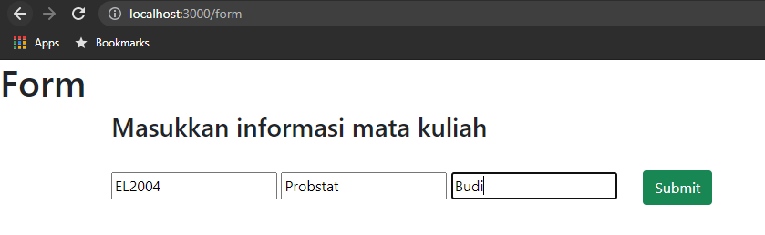
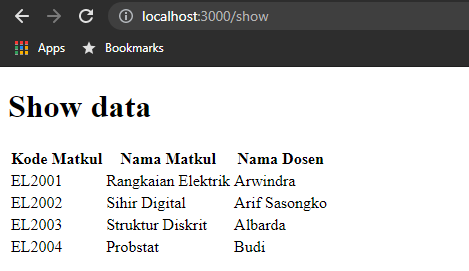
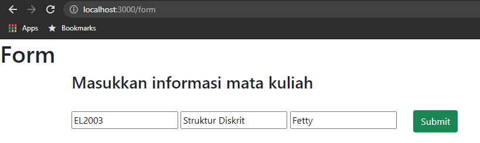
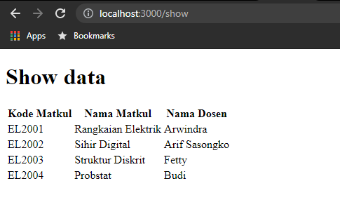
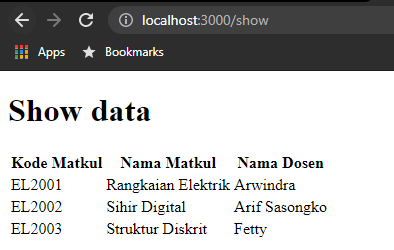

Penjelasan API
=====================

1. Create
URL: /form

2. Read
URL: /show

3. Update
URL: /form
note: Masukkan kode matkul yang ingin diupdate

4. Delete
URL: /delete
note: Masukkan kode matkul yang ingin didelete

