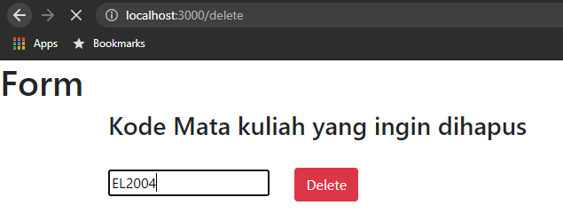

Penjelasan API
=====================

1. Create (/form)

2. Read (/show)

3. Update (/form)

note: Masukkan kode matkul yang ingin diupdate

4. Delete /delete

note: Masukkan kode matkul yang ingin didelete

